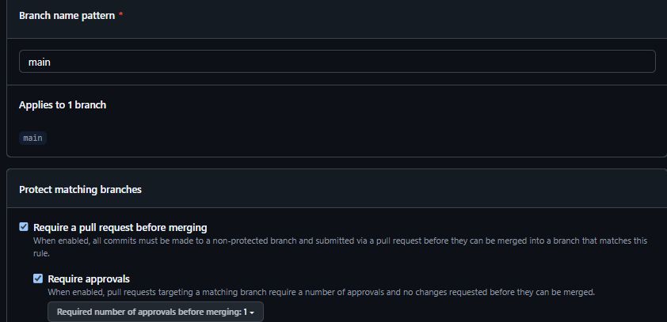
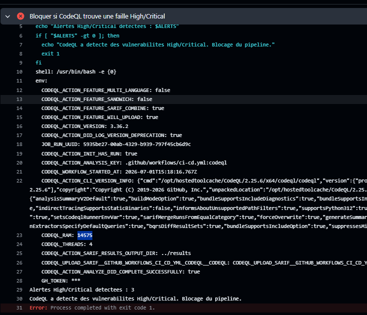

# Projet final DevSecOps — Industrialisation, durcissement et architecture CI/CD

## 1. Contexte du projet

Ce dépôt contient une application composée de deux parties :

* **Frontend** (`frontend/`) : une interface web statique (HTML) qui consomme l'API.
* **Backend** (`backend/`) : une API REST en Node.js / Express, manipulant des données sensibles (clés d'API, accès à des infrastructures externes).

L'objectif du projet n'est pas de développer ces deux briques, mais de construire **autour d'elles** une chaîne CI/CD industrialisée et durcie : gouvernance Git stricte, sécurité appliquée le plus tôt possible dans le cycle de développement (Shift Left), gestion chiffrée des secrets, conteneurisation scannée, pipeline GitHub Actions avec contrôles bloquants, puis déploiement automatisé (frontend sur GitHub Pages, backend sur Vercel).

Ce README documente, bloc par bloc, ce qui a été mis en place. Il est mis à jour au fur et à mesure de l'avancement du projet.
on as dévisé le projet en 9 blocs, chacun correspondant à un objectif précis du sujet. Chaque bloc est validé par un [x] lorsqu'il est terminé et fonctionnel.

## 2. Architecture actuelle du dépôt

```
.
├── frontend/
│   └── index.html                # Frontend statique (HTML)
├── backend/
│   ├── Dockerfile                 # Build multi-stage, durci
│   ├── package.json
│   ├── package-lock.json
│   ├── src/
│   │   └── app.js                 # API Express
│   └── tests/
│       ├── unit.test.js
│       ├── integration.test.js
│       └── e2e.test.js
├── git_hooks/
│   └── pre-commit                 # Copie versionnée du hook de sécurité local
├── gitleaks.toml                  # Règles de détection de secrets (locales + CI)
├── .sops.yaml                     # Règles de chiffrement SOPS
├── .gitignore
└── .github/
    ├── workflows/
    │   └── ci-cd.yml               # Pipeline CI/CD principal
    ├── actions/
    │   └── trivy-scan/action.yml   # Composite Action - analyse SBOM
    └── secrets-prod.yaml           # Secrets de production, chiffrés par SOPS
```

## 3. Gouvernance Git — Bloc 1 ✅

### Principe

Le code de production doit être **techniquement validé** avant tout déploiement, pas seulement par convention orale. Deux mécanismes GitHub imposent cette règle :

* La **branch protection** sur `main`, qui interdit tout push direct et impose de passer par une Pull Request.
* Un **GitHub Environment** nommé `production`, qui isole les secrets de déploiement et peut restreindre les déploiements à une branche précise.

### Ce qui a été mis en place

* **Branches** :
  * `staging` — branche pivot de développement et d'intégration. Toute la CI s'y exécute à chaque push.
  * `main` — branche de production, protégée.
* **Règle de protection sur `main`** (`Settings > Branches`) :
  * Pull Request obligatoire avant tout merge (push direct refusé)
  * Status checks requis avant de pouvoir merger
  * Règles non contournables, y compris pour les administrateurs
  * Nombre de reviews requises ajusté selon la taille de l'équipe sur le projet (0 en solo, 1 dès qu'un collaborateur avec accès en écriture est disponible)
* **Environment `production`** (`Settings > Environments`) : reçoit les secrets de déploiement (SOPS, Vercel).
* **Workflow** `.github/workflows/ci-cd.yml` déclenché sur `push` vers `staging` et `main`, avec `permissions: contents: read` au niveau global (moindre privilège).

## 4. Sécurité locale — Shift Left — Bloc 2 ✅

### Principe

Le Shift Left consiste à déplacer les contrôles de sécurité le plus tôt possible dans le cycle de développement — idéalement avant même le commit — plutôt que de découvrir un problème en CI ou en production. Un hook Git local (`pre-commit`) permet de bloquer un commit dangereux avant qu'il n'atteigne GitHub.

### Ce qui a été mis en place

Le hook `pre-commit` valide séquentiellement trois contrôles avant d'autoriser un commit :

1. **`actionlint`** sur l'ensemble des fichiers de `.github/workflows/` — vérifie la syntaxe des workflows GitHub Actions.
2. **`gitleaks`** en mode `--staged` — scanne uniquement les fichiers déjà ajoutés à l'index (`git add`), à la recherche de secrets, en s'appuyant sur `gitleaks.toml`.
3. **Blocage par extension** — si un fichier `.env`, `.pem` ou `.key` est détecté parmi les fichiers stagés, le commit est immédiatement annulé avec un message d'erreur explicite.

### Règle de détection personnalisée (`gitleaks.toml`)

En plus des règles par défaut de gitleaks (`useDefault = true`), une règle personnalisée détecte les jetons internes de l'entreprise au format `SECWALLET_` suivi de 24 caractères alphanumériques majuscules, avec une vérification d'entropie pour limiter les faux positifs.

### Preuve de fonctionnement en conditions réelles

Ce hook a réellement bloqué, en cours de projet : un token `SECWALLET_` planté dans `backend/src/app.js`, et à deux reprises une tentative de commit accidentel de `ops.txt` (la clé privée `age` du Bloc 3). Aucun des deux n'a atteint le dépôt distant.

### Installation du hook (obligatoire pour chaque contributeur)

Le dossier `.git/hooks/` n'est jamais envoyé sur GitHub (il n'est pas suivi par Git). Une copie du script est donc versionnée dans `git_hooks/pre-commit` :

```bash
cp git_hooks/pre-commit .git/hooks/pre-commit
chmod +x .git/hooks/pre-commit
```

## 5. Gestion des secrets par enveloppe — Bloc 3 ✅

### Principe

La philosophie GitOps interdit tout secret de production en clair dans le dépôt, tout en gardant les fichiers de configuration auditables. `age` fournit le chiffrement asymétrique (clé publique pour chiffrer, clé privée pour déchiffrer) ; `SOPS` chiffre uniquement les **valeurs** d'un fichier YAML, en laissant les clés structurelles lisibles — un `git diff` reste donc compréhensible.

### Ce qui a été mis en place

* Paire de clés générée via `age-keygen -o ops.txt`. **`ops.txt` (clé privée) n'est jamais commité** — exclu via `.gitignore` dès sa création.
* `.github/secrets-prod.yaml` contient `DATABASE_URL` et `JWT_SECRET`, chiffré avec `sops --encrypt --in-place`.
* `.sops.yaml` définit la règle de chiffrement (`creation_rules`) associant ce fichier à la clé publique `age`.
* La clé privée est stockée comme secret GitHub `SOPS_AGE_KEY`, dans l'environment `production` (jamais dans le code).

## 6. Conteneurisation du backend — Bloc 4 ✅

### Principe

L'image Docker livrée en production ne doit contenir que le strict nécessaire à l'exécution : moins un composant est présent, plus la surface d'attaque est réduite et moins il y a de chances qu'un scan de vulnérabilités remonte un faux problème sur un outil jamais utilisé.

### Ce qui a été mis en place

* **`backend/Dockerfile`** en build multi-stage (`node:22-alpine`) : un stage `deps` installe les dépendances de production (`npm ci --omit=dev`), un stage final ne récupère que `node_modules` et le code applicatif, tourne en utilisateur non-root.
* **Durcissement de l'image finale** : suppression explicite de `npm`, `npx`, `corepack`, `yarn` et `pnpm` — tous embarqués par défaut dans l'image `node:22-alpine` mais jamais utilisés au runtime (l'app démarre directement via `node`). Cette suppression a éliminé plusieurs vulnérabilités HIGH détectées par le scan (dépendances internes de ces outils, pas du code applicatif).
* **Suppression de la dépendance `growl`** (`backend/package.json`) : dépendance de production jamais utilisée dans le code, qui embarquait `eslint-plugin-node` et une version vulnérable de `semver` (CVE-2022-25883). Diagnostiquée via `npm why semver`.
* **Filtrage par chemin ciblé** : un job dédié `changes` (`dorny/paths-filter`) détecte si `backend/**` a changé ; seul le job `scan-image` en dépend, pas le workflow entier — `test` continue de s'exécuter à chaque push, conformément à l'exigence du sujet.
* **SBOM** généré au format CycloneDX JSON (`anchore/sbom-action`) avant le scan.
* **Scan Trivy** bloquant sur toute vulnérabilité `HIGH` ou `CRITICAL`, action épinglée par **hash de commit** (pas seulement par tag) suite à la compromission de supply chain découverte sur `aquasecurity/trivy-action` en mars 2026 (tags `0.0.1` à `0.34.2` touchés).
* **Transport de l'image entre jobs** : chaque job GitHub Actions tourne sur un runner isolé ; l'image construite dans `scan-image` est exportée (`docker save`), envoyée en artefact GitHub Actions, puis rechargée (`docker load`) dans le job `publish`.
* **Publication conditionnelle sur GHCR** : uniquement si le scan est passé, avec un nom d'image fixe et systématiquement en minuscules (`ghcr.io/<owner>/devsecops-backend`) — le nom du dépôt lui-même contient des caractères invalides pour une référence Docker (mélange de majuscules et de séparateurs `-`/`_`).

## 7. Composite Action — analyse SBOM — Bloc 5 ✅

### Principe

Une Composite Action regroupe plusieurs étapes dans une action réutilisable, avec son propre `action.yml`, appelable comme n'importe quelle action du marketplace mais définie localement. Elle centralise la logique de scan plutôt que de la dupliquer dans le workflow principal.

### Ce qui a été mis en place

* **`.github/actions/trivy-scan/action.yml`**, de type `composite`, avec un input obligatoire `sbom-path` (chemin du SBOM CycloneDX généré au Bloc 4).
* Installation de Trivy **épinglée à une version précise** (`v0.70.0`), pas sur la branche `main` du script d'installation, pour éviter de dépendre d'une source mouvante.
* **Politique de sévérité différenciée**, complémentaire au scan d'image du Bloc 4 :
  * Une vulnérabilité `CRITICAL` sur le SBOM fait échouer le job (`--exit-code 1`).
  * Une vulnérabilité `HIGH` ou `MEDIUM` est seulement signalée dans le résumé du workflow (`$GITHUB_STEP_SUMMARY`), sans bloquer le pipeline.
* Appelée depuis `scan-image` juste après la génération du SBOM, en plus (pas à la place) du scan d'image qui, lui, bloque déjà sur `HIGH` ou `CRITICAL`.

## 8. Pipeline CI principal durci — Bloc 6 ✅

### Principe

Chaque job ne doit disposer que des droits strictement nécessaires à sa tâche (moindre privilège), et un déploiement ne doit jamais avoir lieu si un contrôle de sécurité a échoué — sans exception ni `continue-on-error` sur les étapes critiques.

### Ce qui a été mis en place

* **`test`** exécute réellement `npm ci` puis `npm test` (auparavant un simple `checkout` sans rien exécuter), avec des variables d'environnement factices (`DATABASE_URL`, `JWT_SECRET`) pour que le healthcheck applicatif passe en CI sans dépendre des vrais secrets de production. Cache npm actif via `actions/setup-node`.
* **`gitleaks-ci`** : nouveau job, historique complet récupéré (`fetch-depth: 0`), aucun `continue-on-error` sur cette étape.
* **`codeql`** : nouveau job, analyse statique du code JavaScript, `security-events: write` isolé localement à ce job (pas au workflow entier).
* **Chaînage** : `deploy-backend` et `deploy-frontend` dépendent désormais de `test`, `gitleaks-ci` **et** `codeql` — un seul échec bloque tout déploiement.

### Deux bugs applicatifs corrigés au passage

En branchant les vrais tests dans la CI, deux problèmes déjà corrigés localement s'étaient perdus pendant la réorganisation en `backend/`/`frontend/` et ont dû être réappliqués sur `backend/src/app.js` :

* Absence de `express.static(...)` pour servir `frontend/index.html` (le test e2e recevait un 404).
* `app.listen()` s'exécutait à chaque `require()` du module (y compris depuis les tests), provoquant un `EADDRINUSE` dès que deux suites de tests s'enchaînaient. Corrigé en le conditionnant à `require.main === module`, pour qu'il ne s'exécute qu'en lancement direct (`node src/app.js`), jamais quand le fichier est importé par un test.
exemple de test de codeQL

## 9. CD Frontend — GitHub Pages — Bloc 7 ✅

### Principe

L'API moderne d'artefacts de déploiement GitHub Pages évite de committer le résultat d'un build sur une branche dédiée (`gh-pages`), ce qui garde l'historique Git propre. L'authentification se fait via OIDC, sans jeton stocké à l'avance.

### Ce qui a été mis en place

* Source des Pages configurée sur **GitHub Actions** (`Settings > Pages > Build and deployment`).
* Job `deploy-frontend` : dépend de `test`, `gitleaks-ci`, `codeql` ; ne s'exécute que sur `main`.
* Permissions dédiées `pages: write` et `id-token: write`, isolées à ce job.
* `actions/upload-pages-artifact` (packageant `frontend/`) puis `actions/deploy-pages`.

## 10. CD Backend — Vercel — Bloc 8 ✅

### Principe

Le déploiement backend s'orchestre en ligne de commande depuis GitHub Actions. Les secrets de production ne doivent jamais être écrits en clair sur le disque du runner : le déchiffrement doit rester entièrement en mémoire.

### Ce qui a été mis en place

* Job `deploy-backend` : installe `sops`, `yq` et le CLI Vercel.
* Déchiffrement de `.github/secrets-prod.yaml` (clé `SOPS_AGE_KEY`) directement dans `/dev/shm` (système de fichiers en RAM), jamais sur le disque physique du runner ; le fichier déchiffré est supprimé explicitement juste après extraction des valeurs.
* Valeurs extraites masquées dans les logs (`::add-mask::`) avant d'être exposées comme variables d'environnement du job.
* Déploiement via `vercel pull` + `vercel deploy --prod`, secrets injectés directement dans la commande.
* URL de production capturée dans `$GITHUB_ENV` (`PROD_URL`), réutilisée au Bloc 9.

## 11. Robustesse — concurrence et healthcheck — Bloc 9 ✅

### Principe

Un `concurrency group` évite de gaspiller des ressources sur un déploiement devenu obsolète si un nouveau commit arrive entre-temps. Un healthcheck post-déploiement confirme que l'application répond réellement, ce qui est différent de constater que la commande de déploiement s'est juste terminée sans erreur.

### Ce qui a été mis en place

* `concurrency: group: ${{ github.workflow }}-${{ github.ref }}` avec `cancel-in-progress: true`, au niveau du workflow entier : un nouveau push sur une branche annule automatiquement le run précédent encore actif sur **cette même branche** (le `github.ref` isole `staging` de `main`, aucune interférence entre les deux).
* Étape finale de `deploy-backend` : requête `curl` vers `$PROD_URL/api/health`, le job échoue si la réponse n'est pas `200`.

## 12. Installation et utilisation de l'application

### Prérequis

Node.js (version 22 ou supérieure).

### Installation des dépendances

```bash
cd backend
npm ci
```

### Exécution des tests

```bash
DATABASE_URL="postgres://localhost/test" JWT_SECRET="dummy-local-secret" npm test
```

### Démarrage de l'application

```bash
npm start
```

L'application est accessible sur `http://localhost:3000`.

### Construire et tester l'image Docker en local

```bash
cd backend
docker build -t backend:test .
```

## 13. Avancement du projet

- [x] **Bloc 1** — Gouvernance Git (branches, branch protection, environment `production`, squelette du workflow)
- [x] **Bloc 2** — Sécurité locale / Shift Left (hook pre-commit, règles gitleaks personnalisées)
- [x] **Bloc 3** — Gestion des secrets par enveloppe (age + SOPS)
- [x] **Bloc 4** — Conteneurisation du backend (Dockerfile multi-stage durci, SBOM, scan Trivy, publication GHCR)
- [x] **Bloc 5** — Composite Action Trivy (analyse SBOM réutilisable, politique de sévérité différenciée)
- [x] **Bloc 6** — Pipeline CI principal durci (tests réels, gitleaks en CI, CodeQL, chaînage des jobs de sécurité)
- [x] **Bloc 7** — CD Frontend (GitHub Pages via artefacts de déploiement)
- [x] **Bloc 8** — CD Backend (Vercel + déchiffrement SOPS au runtime)
- [x] **Bloc 9** — Robustesse (concurrency, healthcheck post-déploiement)
- [ ] **Bloc 10** — Livrables finaux

## 14. Livrables

À déposer sur Moodle en fin de projet : un fichier texte contenant l'URL de production Vercel, l'URL GitHub Pages, et l'URL du dépôt GitHub public, accompagné de tout fichier jugé utile (captures d'écran, scripts).
